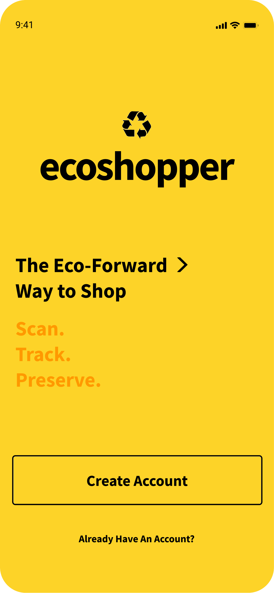
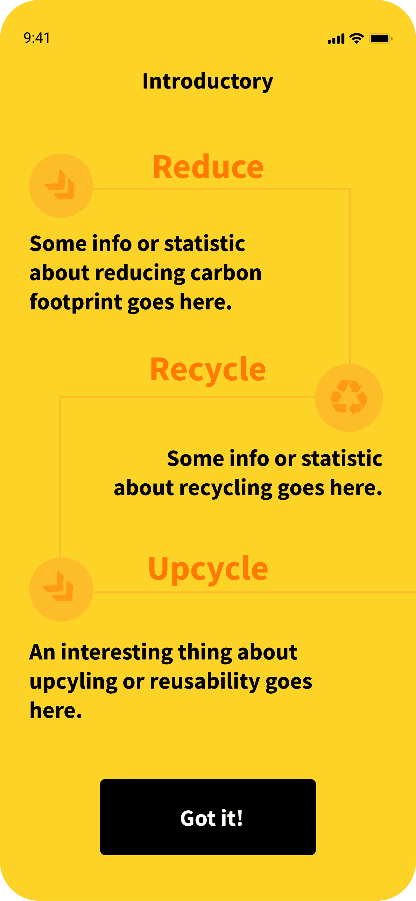
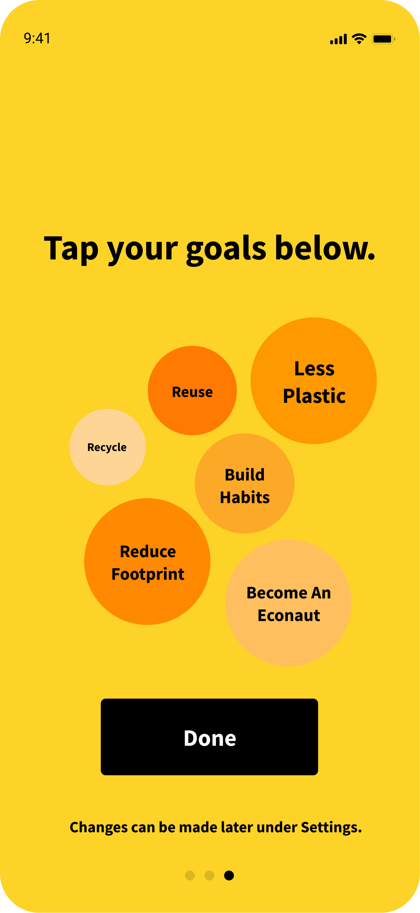
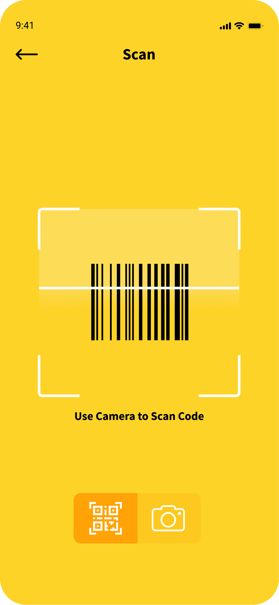
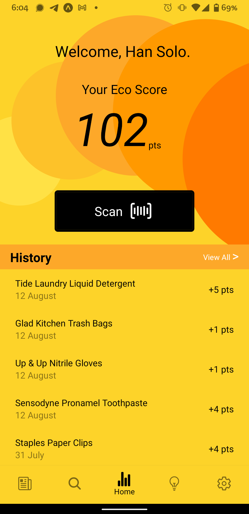
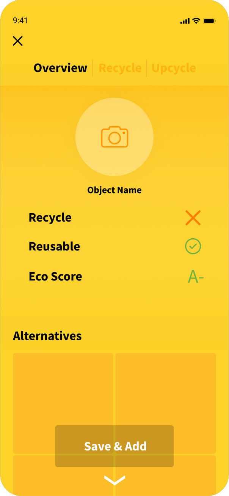
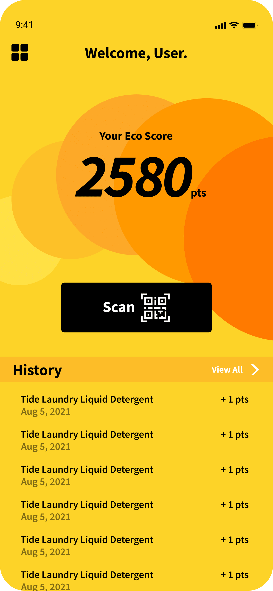

# ecoshopper ♻️ 🛒

<div class="row" style="text-align: center">
  <div style="display: inline-block">
    
  </div>
  <div style="display: inline-block">
    
  </div>
  <div style="display: inline-block">
    
  </div>
  <div style="display: inline-block">
    
  </div>
  <div style="display: inline-block">
    
  </div>
  <div style="display: inline-block">
    
  </div>
  <div style="display: inline-block">
    
  </div>
</div>


Ecoshopper was a prototype mobile web application designed as part of a final project for the Summer 2021 iteration of UC Berkeley's CS 160. The core of the app is an image classifier (pretrained VGG-16) that was fine tuned on the [TrashNet](https://github.com/garythung/trashnet#trashnet) dataset for the task of identifying recylable goods from non-recyclable goods. The model pipeline involved a fairly unique method that extracted metadata from an item's barcode to reverse search n (n being odd) images most relevant to the query. The classifier ran inference on the images and returned a prediction (recyclable or non-recyclable). The model was implemented with PyTorch and deployed with Django, while the front-end was built with React Native.

<div style="text-align: center">
  
</div>

</div>


Note: This repository is no longer active.</div>


## Installation & Running the App

If you do not wish to reproduce the environment and necessary dependencies, you can jump right ahead to [Using the React Native Web Console](#use-the-react-native-web-console) section, which doess not require installation.

1. First, make sure you have `npm` installed. Follow the guide here: [node.js Download](https://nodejs.org/en/download/)

2. Change into the `ecoShopperReact` folder with:

   ```
   cd ecoShopperReact
   ```

3. Run the following commands:

   ```
   npm install -g expo-cli
   expo install
   expo start
   ```

Then, the Expo developer tools should open in your browser window.

4. Next, click "Run in web browser". This will open up a new tab. After, access the developer tools on your browser and change the device layout to a mobile layout (e.g. iPhone X). Additionally, the app can be run within the [Expo Go app](https://expo.dev/tools#client) on a mobile device.
